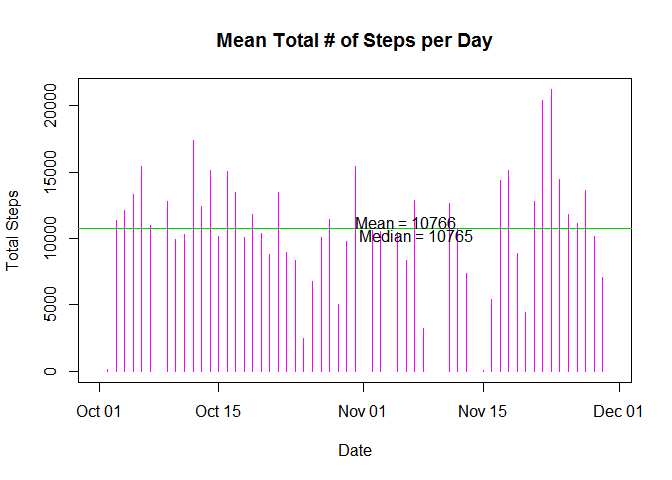
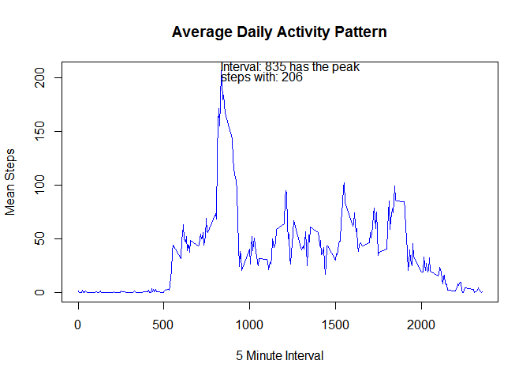
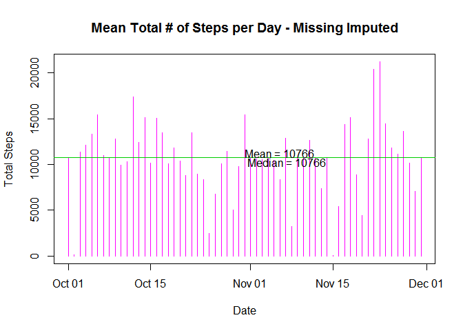
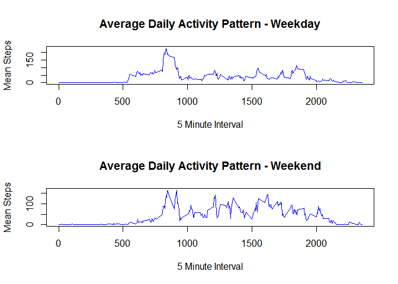

# PA1
  
December 20, 2015  


##Loading and preprocessing the data

```r
mydata <- read.csv(file = "activity.csv", stringsAsFactors = FALSE)
mydata$date <- as.Date(mydata$date, "%Y-%m-%d")
```

##What is mean total number of steps taken per day?

```r
library(dplyr)
```

```
## Warning: package 'dplyr' was built under R version 3.2.3
```

```
## 
## Attaching package: 'dplyr'
## 
## The following objects are masked from 'package:stats':
## 
##     filter, lag
## 
## The following objects are masked from 'package:base':
## 
##     intersect, setdiff, setequal, union
```

```r
grp_by_day <- group_by(mydata, date) 
tot_steps_byday <- summarize(grp_by_day, tot_steps = sum(steps))
mean_tot_steps <- mean(tot_steps_byday$tot_steps, na.rm = TRUE)
median_tot_steps <- median(tot_steps_byday$tot_steps, na.rm = TRUE)
meandt <- mean(tot_steps_byday$date)
plot(x = tot_steps_byday$date, y = tot_steps_byday$tot_steps, type = "h", xlab = "Date", ylab = "Total Steps", main = "Mean Total # of Steps per Day", col=6)
abline(h=mean_tot_steps, col=2)
abline(h=median_tot_steps, col=3)
text(meandt,mean_tot_steps ,paste("Mean = ", round(mean_tot_steps), sep = ""),  adj = c(0, 0))
text(meandt,mean_tot_steps ,paste(" Median = ", round(median_tot_steps), sep = ""),  adj = c(0, 1))
```

 


##What is the average daily activity pattern?

```r
myint <- unique(mydata$interval)
vectint <- NULL
vect_mean_steps <- NULL
for(i in myint) {
  intset <- mydata[mydata$interval == i,]
  meaninset <- mean(intset$steps, na.rm = TRUE)
  vectint <- c(vectint, i)
  vect_mean_steps <- c(vect_mean_steps, meaninset)
}
daily_act <- data.frame(cbind(vectint, vect_mean_steps)) 
names(daily_act) <- c("Interval", "MeanSteps")
whichint <- daily_act[daily_act$MeanSteps == max(daily_act$MeanSteps), 1]
whatsteps <- daily_act[daily_act$MeanSteps == max(daily_act$MeanSteps), 2]
plot(x=daily_act$Interval, y=daily_act$MeanSteps, type = "l", xlab = "5 Minute Interval", ylab = "Mean Steps", main = "Average Daily Activity Pattern", col=4)
text(whichint,whatsteps ,paste("Interval: ", round(whichint), " has the peak ", sep = ""),  adj = c(0, 0))
text(whichint,whatsteps ,paste("steps with: ", round(whatsteps),  sep = ""),  adj = c(0, 1))
```

 

##Imputing missing values


```r
ndx <- complete.cases(mydata)
mydata1 <- mydata[ndx,]
totmissing <- nrow(mydata) - nrow(mydata1)
```


Imputing Missing values using 5-Minute interval


```r
ndx1 <- which(is.na(mydata$steps))
for(j in ndx1) {
  mydata[j,1] <- daily_act[daily_act$Interval == mydata[j,3],2]
}

# Plotting histogram
mean_tot_steps <- NULL
median_tot_steps <- NULL
meandt <- NULL
grp_by_day <- group_by(mydata, date) 
tot_steps_byday <- summarize(grp_by_day, tot_steps = sum(steps))
mean_tot_steps <- mean(tot_steps_byday$tot_steps)
median_tot_steps <- median(tot_steps_byday$tot_steps)
meandt <- mean(tot_steps_byday$date)
plot(x = tot_steps_byday$date, y = tot_steps_byday$tot_steps, type = "h", xlab = "Date", ylab = "Total Steps", main = "Mean Total # of Steps per Day - Missing Imputed", col=6)
abline(h=mean_tot_steps, col=2)
abline(h=median_tot_steps, col=3)
text(meandt,mean_tot_steps ,paste("Mean = ", round(mean_tot_steps), sep = ""),  adj = c(0, 0))
text(meandt,mean_tot_steps ,paste(" Median = ", round(median_tot_steps), sep = ""),  adj = c(0, 1))
```

 

There is no impact on the Mean and Median values after imputing

##Are there differences in activity patterns between weekdays and weekends?


```r
mydata$weekend <- as.factor(weekdays(mydata$date) %in% c("Saturday", "Sunday")) 
levels(mydata$weekend) <- c("Weekday", "Weekend")


par(mfrow=c(2,1))
for(j in levels(mydata$weekend)) {
  vectint <- NULL
  vect_mean_steps <- NULL
  intset <- NULL
  vect_mean_steps <- NULL
  
  for(i in unique(mydata$interval)) {
    intset <- mydata[mydata$interval == i & mydata$weekend == j,]
    meaninset <- mean(intset$steps )
    vectint <- c(vectint, i)
    vect_mean_steps <- c(vect_mean_steps, meaninset)
  }
  daily_act <- data.frame(cbind(vectint, vect_mean_steps)) 
  names(daily_act) <- c("Interval", "MeanSteps")
  whichint <- daily_act[daily_act$MeanSteps == max(daily_act$MeanSteps), 1]
  whatsteps <- daily_act[daily_act$MeanSteps == max(daily_act$MeanSteps), 2]
  plot(x=daily_act$Interval, y=daily_act$MeanSteps, type = "l", xlab = "5 Minute Interval", ylab = "Mean Steps", main = paste("Average Daily Activity Pattern - ", j, sep = "" ), col=4)
}
```

 
